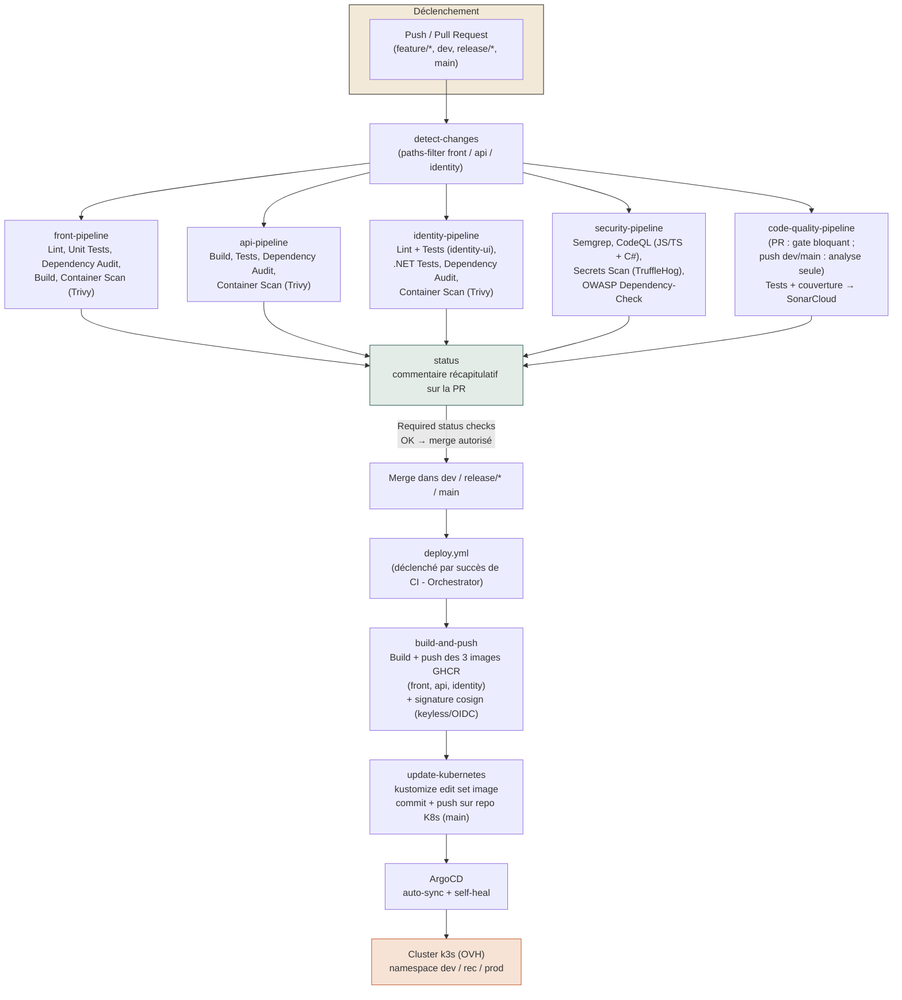

# Cycle de vie DevSecOps et pipeline CI/CD

## Cycle de vie du développement (DevSecOps)

Le cycle de vie suit les huit étapes classiques du DevSecOps ; la sécurité n'est pas une étape à part mais une exigence intégrée à chacune d'elles ("shift-left").

| Étape | Activité | Mesures de sécurité |
|---|---|---|
| **1. Plan** | Rédaction du backlog (user stories + critères d'acceptation, voir [Backlog](./06-backlog-fonctionnalite-metier.md)) | Les critères d'acceptation incluent explicitement les cas d'abus (mot de passe faible, email déjà utilisé, annonce invalide) — la sécurité fonctionnelle est pensée dès la spécification. |
| **2. Code** | Développement en branche `feature/*` (GitFlow), revue de code obligatoire via Pull Request | Aucun secret en dur (`.gitignore` exhaustif) ; historique git nettoyé après l'incident initial de PAT exposé (Phase 0 du projet) ; TypeScript strict et C# `Nullable` activés pour réduire les classes d'erreurs. |
| **3. Build** | `npm ci` / `dotnet restore`, build Docker multi-stage | Images de base Alpine (surface d'attaque réduite), stage de build séparé du stage d'exécution (le SDK .NET/Node n'est jamais présent dans l'image finale). |
| **4. Test** | Tests unitaires, intégration, SAST, SCA, secrets (voir [Processus de test](./02-processus-test.md)) | Chaque scan est un *required status check* : une vulnérabilité ou une régression de couverture bloque la fusion vers `dev`. |
| **5. Release** | Push de l'image vers GHCR, tag au SHA court du commit | Signature **cosign keyless** (OIDC GitHub Actions, sans clé privée à gérer) juste après le push — garantit la provenance de l'image avant tout déploiement. |
| **6. Deploy** | GitOps via ArgoCD (auto-sync + self-heal), overlays Kustomize dev/rec/prod | Secrets applicatifs chiffrés en Git via **Bitnami Sealed Secrets** (déchiffrables uniquement par le contrôleur du cluster cible) ; TLS automatique via **cert-manager** + Let's Encrypt. |
| **7. Operate** | Exécution des pods sur le cluster k3s (OVH) | `securityContext` non-root (UID 1000), `readOnlyRootFilesystem`, capacités Linux réduites à zéro (`drop: ALL`), `seccompProfile: RuntimeDefault`, Pod Security Standards `baseline` au niveau namespace, `NetworkPolicy` restreignant les flux entrants à l'ingress. |
| **8. Monitor** | Observabilité continue | Métriques (Prometheus/Grafana), logs centralisés (Loki/Promtail), scan IaC continu (Kubescape) et scan d'images en cluster (Trivy Operator) — permet de détecter une dérive de sécurité *après* le déploiement, pas seulement avant. |

## Schéma détaillé du pipeline CI/CD

## Correspondance outils ↔ indicateurs qualité

| Outil | Job du pipeline | Indicateur qualité alimenté |
|---|---|---|
| Vitest / xUnit + coverlet | `front-pipeline`, `api-pipeline`, `code-quality-pipeline` | Couverture de tests (indicateur 1) |
| SonarCloud (Quality Gate) | `code-quality-pipeline` | Couverture + ratings reliability/security/maintainability (indicateurs 1 et 2) |
| Trivy, Semgrep, CodeQL, Dependency-Check, TruffleHog | `security-pipeline`, `*-pipeline / Container Scan` | Alimentent le [plan de remédiation sécurité](./08-plan-remediation-securite.md) |
| Kubescape | Workflow dédié (repo Kubernetes) | Alimente le plan de remédiation (posture IaC) |
| Siege | Manuel | Temps de réponse / disponibilité (indicateurs 3 et 4) |
