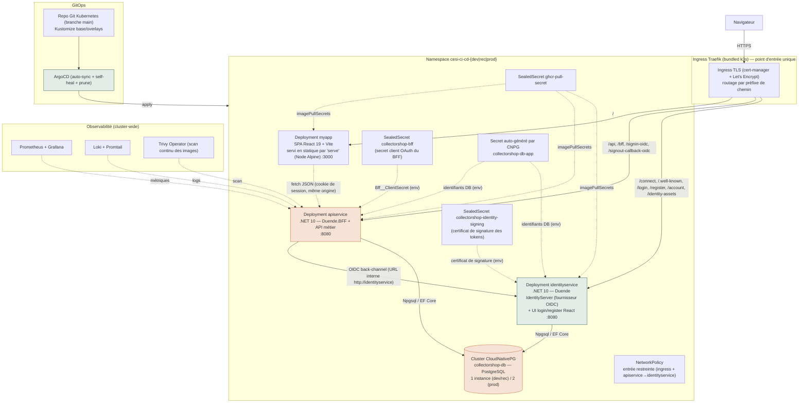
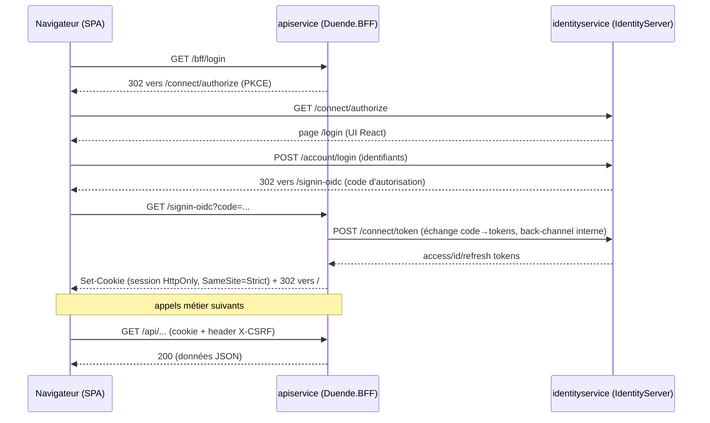

# Architecture technique

## Vue d'ensemble

> **Point d'architecture clé** : l'entrée sur le domaine public est l'**ingress Traefik** (reverse proxy), *pas* le BFF. Les fichiers statiques du SPA sont servis par un **pod dédié `myapp`** (`serve -s dist`) ; le BFF ne sert aucun fichier statique. Les trois services sont indépendants (déploiement/scalabilité séparés) et unifiés uniquement par le routage de chemin de l'ingress — même origine, donc pas de CORS ni de cookie cross-site.

## Découpage applicatif

| Composant | Techno | Rôle |
|---|---|---|
| `myapp` | React 19 + Vite, TanStack Query, React Hook Form + Zod, Tailwind CSS v4 | SPA : UI publique (catalogue, fiche produit) et authentifiée (publication d'annonce, messagerie, profil, modération admin). Ne détient aucun token. |
| `apiservice` | .NET 10, ASP.NET Core Minimal API, **Duende.BFF**, EF Core 10 | **Backend-for-Frontend** (client OAuth confidentiel : orchestre le flow OIDC, garde les tokens côté serveur, pose le cookie de session) **et** API métier REST (catalogue, annonces + contrôle qualité, chat, notifications, centres d'intérêt, modération). |
| `identityservice` | .NET 10, **Duende IdentityServer**, EF Core 10 | Fournisseur d'identité OpenID Connect autonome : endpoints `/connect/*`, discovery document, émission de tokens signés (Authorization Code + PKCE), inscription/connexion/déconnexion. Sert aussi sa propre petite UI React de login. |
| `collectorshop-db` | PostgreSQL via l'opérateur CloudNativePG | Persistance partagée (utilisateurs, catégories, annonces, conversations, notifications). |

Le découpage sépare les **trois responsabilités** (présentation / sécurité-authentification / données) : le SPA n'a aucun secret ni token, le BFF est le seul client OAuth confidentiel, l'IdentityServer est le seul propriétaire des identifiants et de la signature des tokens. Ce n'est pas un découpage microservices complet (le BFF héberge aussi l'API métier), choix justifié par le périmètre du prototype — mais l'authentification est bien isolée dans un service dédié, ce qui permet d'ajouter demain un client tiers (mobile, partenaire) sur le même IdP sans toucher au métier.

## Authentification — OAuth 2.0 / OpenID Connect via le pattern BFF

- **Aucun token dans le navigateur** : les tokens OIDC restent côté serveur (custody par le BFF). Le navigateur ne détient qu'un **cookie de session `HttpOnly`, `SameSite=Strict`, `Secure`** — non lisible en JavaScript, donc non exfiltrable par XSS (le motif d'abandon de l'ancien JWT-en-`localStorage`).
- **Protection CSRF** : `.AsBffApiEndpoint()` exige un header statique `X-CSRF: 1` sur tout appel `/api/*` (distingue un appel du SPA d'une requête cross-site).
- **Flow standard** : Authorization Code + **PKCE** obligatoire, discovery document (`/.well-known/openid-configuration`), tokens signés RS256. C'est un vrai serveur OIDC conforme, pas un raccourci.
- **Rôles** : le claim `role` (ex. `Admin`) porté par les tokens alimente la policy `AdminOnly` côté API métier (back-office de modération).
- **Split-horizon** : le BFF joint l'IdP par l'URL interne au cluster `http://identityservice` (back-channel token/userinfo/discovery), mais réécrit les endpoints *browser-facing* (`authorize`, `end_session`) vers l'origine publique — sans quoi le navigateur recevrait une URL interne injoignable.

## Communication interservice

- **Client ↔ Ingress** : HTTPS/TLS, certificat émis automatiquement par cert-manager (Let's Encrypt).
- **Ingress → services** : routage par chemin sur un seul domaine (`/`→`myapp`, `/api`+`/bff`+callbacks OIDC→`apiservice`, `/connect`+`/login`+`/account`+…→`identityservice`) — même origine, pas de CORS en production.
- **BFF → IdentityServer** : appels OIDC back-channel via l'URL interne au cluster (`http://identityservice`), plus rapides et sans détour par l'ingress public ; trafic cantonné par NetworkPolicy.
- **Services → PostgreSQL** : Npgsql via EF Core, chaîne de connexion composée dynamiquement à partir des clés du Secret généré par CNPG (interpolation `$(VAR)` Kubernetes), jamais en clair.

## Sécurité (par couche)

| Couche | Mesure |
|---|---|
| Transport | TLS partout via cert-manager (Let's Encrypt staging puis prod) |
| Authentification | **OAuth 2.0 / OIDC** (Duende IdentityServer, Authorization Code + PKCE, tokens RS256) ; pattern **BFF** cookie-only (`HttpOnly`/`SameSite=Strict`/`Secure`), aucun token exposé au navigateur ; mots de passe hashés via `PasswordHasher<T>` ; rate limiting sur register/login |
| Secrets | Aucun secret en clair dans Git : `Bitnami Sealed Secrets` pour le pull GHCR, le secret client OAuth du BFF (`collectorshop-bff`) et le certificat de signature de l'IdP (`collectorshop-identity-signing`) ; les identifiants PostgreSQL sont générés et gérés par l'opérateur CNPG (jamais commis) |
| Réseau | `NetworkPolicy` limitant l'entrée : ingress-controller vers les services, et `apiservice`→`identityservice` sur le trafic interne uniquement |
| Exécution des pods | `securityContext` non-root (UID 1000), `readOnlyRootFilesystem`, capacités Linux réduites à zéro, `seccompProfile: RuntimeDefault`, `automountServiceAccountToken: false`, Pod Security Standards `baseline` au niveau namespace |
| Chaîne CI/CD | Actions GitHub épinglées au SHA de commit, permissions `write` au niveau job (moindre privilège), `npm ci --ignore-scripts` |
| Supply chain | Images signées à la publication (cosign keyless via OIDC GitHub Actions), scannées (Trivy) avant déploiement et en continu en cluster (Trivy Operator) |
| Détection IaC | Kubescape sur les manifests Kubernetes à chaque PR |

## Hébergement et orchestration

- **Hébergement** : un unique VPS OVH exécutant **k3s** (Kubernetes léger mono-nœud). Les trois environnements (`dev`, `rec`, `prod`) cohabitent sur ce même nœud, isolés par namespace + `NetworkPolicy`.
- **Orchestration applicative** : Kubernetes natif (Deployment, Service, Ingress), pas de service mesh (non justifié au vu du nombre de services).
- **GitOps** : ArgoCD surveille une branche unique (`main`) du dépôt Kubernetes ; `auto-sync` + `self-heal` + `prune` garantissent que l'état du cluster converge toujours vers l'état déclaré en Git (**vérifié en conditions réelles** pendant ce projet — voir [protocole d'expérimentation](./07-protocole-experimentation-sandbox.md)).
- **Promotion par environnement** : un push sur `dev` déploie en `dev` ; une branche `release/x.y.z` déploie en `rec` (image taguée par version) ; le merge `release/* → main` déploie en `prod`. Mapping porté par `deploy.yml`.
- **Montée en charge démontrée** : le [test de charge Siege](./01-indicateurs-qualite.md) (913 transactions, 0 échec) et le clustering PostgreSQL à 2 instances en `prod` illustrent la capacité de montée en charge, dans les limites d'un nœud unique.

## Limites assumées de cette architecture

- **Nœud unique** : pas de haute disponibilité réelle au niveau infrastructure (un incident sur le VPS affecte les trois environnements). Assumé pour un prototype, à traiter en priorité en production réelle (multi-nœuds ou offre managée).
- **BFF = API métier dans le même processus** : le BFF héberge aussi les endpoints métier plutôt que de proxifier vers une API distincte. Suffisant au périmètre actuel ; si le métier grossit, l'API pourrait être extraite derrière le BFF sans changer le modèle d'authentification.
- **Licence Duende** : IdentityServer et Duende.BFF tournent en *mode d'évaluation* (gratuit pour développement/test). Un usage production réel imposerait une licence commerciale — point à arbitrer avant toute mise en production hors périmètre pédagogique.
- **Pas de service mesh / API gateway** : non nécessaire à ce nombre de services ; à réévaluer si le nombre de services augmente.
