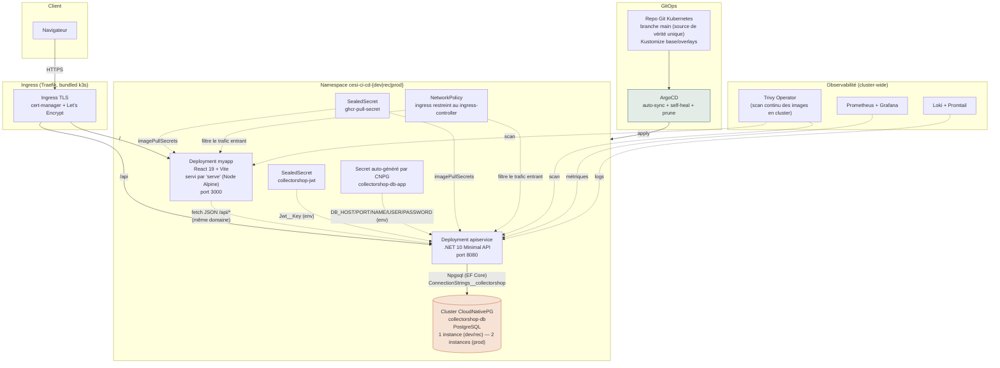

# Architecture technique

## Vue d'ensemble

## Découpage applicatif

| Composant | Techno | Rôle |
|---|---|---|
| `myapp` | React 19 + Vite, TanStack Query, React Hook Form + Zod, Tailwind CSS v4 | UI publique (catalogue, fiche produit) et authentifiée (connexion, publication d'annonce) |
| `apiservice` | .NET 10, ASP.NET Core Minimal API, EF Core 10 | API REST : authentification (JWT), catalogue, publication d'annonces avec contrôle qualité automatique |
| `collectorshop-db` | PostgreSQL via l'opérateur CloudNativePG | Persistance (utilisateurs, catégories, annonces) |

Le découpage suit une architecture **3-tiers classique** (présentation / API / données), sans découpage en microservices : justifié par le périmètre fonctionnel du prototype (une seule fonctionnalité métier implémentée) — un découpage plus fin aurait ajouté de la complexité de communication interservice sans bénéfice à ce stade (voir limites en fin de document).

## Communication interservice

- **Client ↔ Ingress** : HTTPS/TLS, certificat émis automatiquement par cert-manager (Let's Encrypt).
- **Ingress → Front / API** : routage par chemin (`/` → `myapp`, `/api` → `apiservice`) sur le même nom de domaine — évite les problèmes de CORS en production.
- **Front → API** : `fetch` JSON classique. En développement local (Aspire), un proxy Vite redirige `/api/*` vers le port dynamique du service `apiservice` fourni par le *service discovery* d'Aspire (`services__apiservice__http__0`).
- **API → PostgreSQL** : Npgsql via EF Core, chaîne de connexion composée dynamiquement à partir de plusieurs clés du Secret généré par CNPG (interpolation `$(VAR)` Kubernetes), jamais stockée en clair.

## Sécurité (par couche)

| Couche | Mesure |
|---|---|
| Transport | TLS partout via cert-manager (Let's Encrypt staging puis prod) |
| Authentification | JWT (HS256) signé côté API, vérifié par `Microsoft.AspNetCore.Authentication.JwtBearer`, mots de passe hashés via `PasswordHasher<T>` |
| Secrets | Aucun secret en clair dans Git : `Bitnami Sealed Secrets` pour le pull GHCR et la clé JWT ; les identifiants PostgreSQL sont générés et gérés en direct par l'opérateur CNPG (jamais commis) |
| Réseau | `NetworkPolicy` limitant l'entrée vers `apiservice`/`myapp` au seul ingress-controller |
| Exécution des pods | `securityContext` non-root (UID 1000), `readOnlyRootFilesystem`, capacités Linux réduites à zéro, `seccompProfile: RuntimeDefault`, Pod Security Standards `baseline` au niveau namespace |
| Supply chain | Images signées à la publication (cosign keyless via OIDC GitHub Actions), scannées (Trivy) avant déploiement et en continu en cluster (Trivy Operator) |
| Détection IaC | Kubescape sur les manifests Kubernetes à chaque PR |

## Hébergement et orchestration

- **Hébergement** : un unique VPS OVH exécutant **k3s** (Kubernetes léger mono-nœud). Les trois environnements (`dev`, `rec`, `prod`) cohabitent sur ce même nœud, isolés par namespace + `NetworkPolicy`.
- **Orchestration applicative** : Kubernetes natif (Deployment, Service, Ingress), pas de service mesh (non justifié au vu du nombre de services).
- **GitOps** : ArgoCD surveille une branche unique (`main`) du dépôt Kubernetes ; `auto-sync` + `self-heal` + `prune` garantissent que l'état du cluster converge toujours vers l'état déclaré en Git (**vérifié en conditions réelles** pendant ce projet : une modification manuelle du cluster a été automatiquement annulée par ArgoCD car absente de Git — voir [protocole d'expérimentation](./07-protocole-experimentation-sandbox.md)).
- **Montée en charge démontrée** : le [test de charge Siege](./01-indicateurs-qualite.md#3-temps-de-réponse-et-taux-déchec-sous-charge--performance) (913 transactions, 0 échec) et le clustering PostgreSQL à 2 instances en environnement `prod` (patch Kustomize dédié) illustrent la capacité de montée en charge, dans les limites d'un nœud unique.

## Limites assumées de cette architecture

- **Nœud unique** : pas de haute disponibilité réelle au niveau infrastructure (un incident sur le VPS affecte les trois environnements). Assumé pour un contexte de prototype/démonstration, à traiter en priorité dans un contexte de production réelle (multi-nœuds ou offre managée).
- **Authentification maison (JWT custom)** plutôt qu'un serveur d'autorisation dédié (Keycloak) : choix documenté dans les limites du [plan de remédiation](./08-plan-remediation-securite.md), suffisant pour le périmètre actuel (un seul rôle : vendeur/acheteur confondu) mais à revoir si des rôles différenciés (acheteur/vendeur/admin) sont introduits.
- **Pas de service mesh / API gateway** : non nécessaire avec deux services applicatifs ; à réévaluer si le nombre de services augmente.
